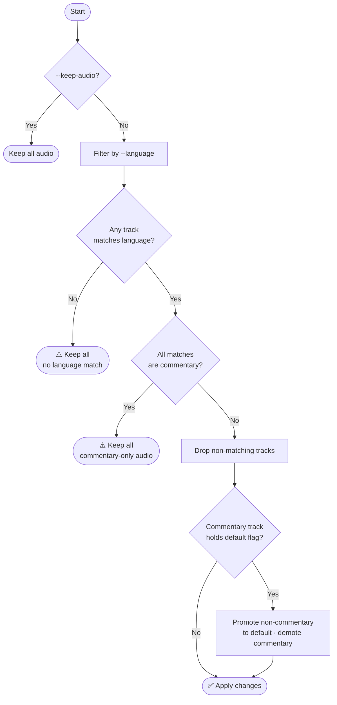
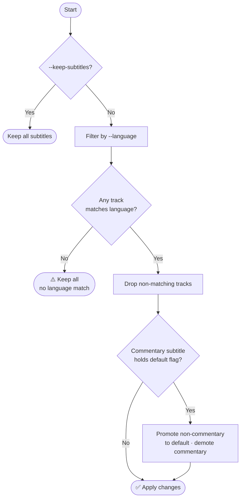

# Trimarr

Removes (trims) unwanted audio and subtitles from matroska container format video files.

## Features

- **Recursive scan** — finds all `.mkv` files under the specified directory tree.
- **Smart skip** — tracks processed files in SQLite using a fingerprint (size + mtime + partial hash); only reprocesses a file if its content has changed.
- **Commentary track safety** — if the default audio or subtitle track is a commentary track, trimarr automatically demotes it and promotes the first non-commentary track to be the new default.
- **Multi-language support** — keep tracks in any combination of languages with a single comma-separated value, e.g. `--language eng,fre` retains both English and French.
- **Language safety fallbacks** — if *no* audio (or subtitle) tracks match the target language(s), all tracks of that type are kept to prevent accidentally silencing a file. Additionally, if all language-matching audio tracks are commentary (e.g. Director's Commentary on a foreign-language film), audio filtering is also skipped. A warning is logged in both cases.
- **Auto-managed mkvmerge** — downloads the mkvmerge binary from MKVToolNix GitHub releases on first run and keeps it up to date automatically (disable with `--no-update-check`).
- **Space savings summary** — reports bytes reclaimed at the end of each run and a cumulative all-time total across all sessions.
- **Graceful interrupt** — Ctrl+C shows a partial summary before exiting with code 130.
- **Safe file replacement** — output is written to a temp file first, then atomically renamed over the original so a failed remux never corrupts the source.

## How it works

Trimarr evaluates audio and subtitle tracks independently for each file.

### Audio tracks



### Subtitle tracks



> If a file needs no changes (all tracks already match, no metadata to edit), it is marked as processed in the database and skipped on all future runs — unless the file content or processing profile changes.

## Prerequisites

- [Python 3.12+](https://www.python.org/downloads/)
- [Astral uv](https://github.com/astral-sh/uv#installation) (optional)

## Quick start

### Installation using uv (recommended)

```bash
git clone https://github.com/binhex/trimarr
cd trimarr
uv venv --quiet
uv sync
```

### Installation using pip

```bash
git clone https://github.com/binhex/trimarr
cd trimarr
python -m venv .venv
source .venv/bin/activate
pip install .
```

### Usage

```bash
trimarr --help
```

## Options

| Option | Description | Default | Example | Type |
| ------ | ----------- | ------- | ------- | ---- |
| `--language` ✱ | One or more ISO 639-2 language codes (comma-separated) for the audio/subtitle tracks to keep. See [ISO 639-2 codes](http://en.wikipedia.org/wiki/List_of_ISO_639-2_codes). | — | `eng` or `eng,fre` | `string` |
| `--media-path` ✱ | Path to the directory containing media files to process (scanned recursively). | — | `/mnt/media/movies` | `path` |
| `--mkvmerge-path` | Path to the mkvmerge executable. When omitted, trimarr manages its own binary and auto-updates it. | Linux: `~/.local/share/trimarr/bin/mkvmerge`<br>Windows: `%LOCALAPPDATA%\trimarr\bin\mkvmerge.exe` | `/usr/bin/mkvmerge` | `path` |
| `--database-path` | Path to the SQLite database file used for tracking processed files. | Linux: `~/.local/share/trimarr/db/trimarr.db`<br>Windows: `%LOCALAPPDATA%\trimarr\db\trimarr.db` | `/var/lib/trimarr/trimarr.db` | `path` |
| `--log-path` | Path to the log file for tracking application events. | Linux: `~/.local/share/trimarr/logs/trimarr.log`<br>Windows: `%LOCALAPPDATA%\trimarr\logs\trimarr.log` | `/var/log/trimarr.log` | `path` |
| `--log-level` | Logging level for console output. Choices: `DEBUG`, `INFO`, `SUCCESS`, `WARNING`, `ERROR`. | `INFO` | `DEBUG` | `choice` |
| `--edit-metadata-title` | Update the container title metadata of each file to match its filename stem. Mutually exclusive with `--delete-metadata-title`. | `false` | — | `flag` |
| `--delete-metadata-title` | Remove the container title metadata from each file. Mutually exclusive with `--edit-metadata-title`. | `false` | — | `flag` |
| `--keep-subtitles` | Keep all subtitle tracks regardless of language. | `false` | — | `flag` |
| `--keep-audio` | Keep all audio tracks regardless of language. | `false` | — | `flag` |
| `--no-backup` | Delete the original file after successful processing instead of renaming it to `<name>.bak`. By default a backup is always created. | `false` | — | `flag` |
| `--no-update-check` | Skip the automatic check for a newer mkvmerge version. Has no effect when `--mkvmerge-path` is supplied (user-managed binaries are never auto-updated). | `false` | — | `flag` |
| `--dry-run` | Log planned changes without modifying any files. Processed files are not recorded to the database in this mode. | `false` | — | `flag` |

✱ Required.

> **Note:** Default paths are platform-aware. On Linux, paths respect `XDG_DATA_HOME` (if set to an absolute path, trimarr uses `$XDG_DATA_HOME/trimarr/`). On Windows, `%LOCALAPPDATA%` is used (falling back to `%APPDATA%`).

## Development

```bash
git clone https://github.com/binhex/trimarr
cd trimarr
uv venv --quiet
uv sync --extra dev
```

If you wish to perform linting on all files before committing (PR will not be
accepted if it does not pass all linting) then run `pre-commit run --all-files`.

## FAQ

WIP
