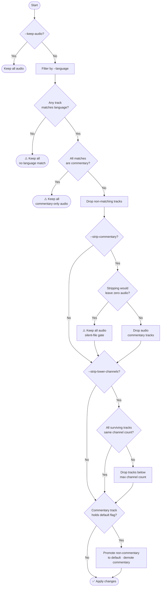
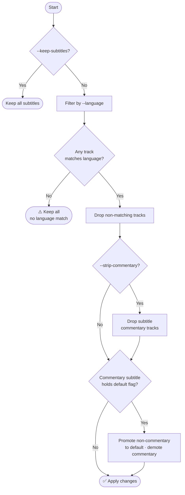

# Trimarr


Removes (trims) unwanted audio and subtitles from matroska container format video files.

## Features

- **Recursive scan** — finds all `.mkv` files under one or more specified directory trees. Pass a comma-separated list to `--media-path` to process multiple roots in a single run; duplicate files (from overlapping paths or symlinks) are automatically deduplicated.
- **Smart skip** — tracks processed files in SQLite using a fingerprint (size + mtime + partial
  hash); only reprocesses a file if its content has changed.
- **Commentary track safety** — if the default audio or subtitle track is a commentary track,
  trimarr automatically demotes it and promotes the first non-commentary track to be the new default.
- **Multi-language support** — keep tracks in any combination of languages with a single
  comma-separated value, e.g. `--language eng,fre` retains both English and French.
- **Language safety fallbacks** — if *no* audio (or subtitle) tracks match the target language(s),
  all tracks of that type are kept to prevent accidentally silencing a file. Additionally, if all
  language-matching audio tracks are commentary (e.g. Director's Commentary on a foreign-language
  film), audio filtering is also skipped. A warning is logged in both cases.
- **Auto-managed mkvmerge** — downloads the mkvmerge binary from MKVToolNix GitHub releases on
  first run and keeps it up to date automatically (disable with `--no-update-check`).
- **Space savings summary** — reports bytes reclaimed at the end of each run and a cumulative
  all-time total across all sessions.
- **Graceful interrupt** — Ctrl+C shows a partial summary before exiting with code 130.
- **Safe file replacement** — output is written to a temp file first, then atomically renamed over
  the original so a failed remux never corrupts the source.
- **Corrupt output safeguard** — before replacing the original, trimarr probes the output with
  `mkvmerge -J` to confirm it is a structurally valid MKV and rejects any output smaller than 50 %
  of the source. If either check fails, all processing halts immediately, the temp file is preserved
  for inspection, and the original file is left untouched. The size guard can be bypassed with
  `--skip-size-check` when legitimate remuxes are expected to produce significantly smaller output
  (e.g. files with very large audio or subtitle payloads).
- **BCP-47 / ISO 639-1 language tag support** — files using IETF `language_ietf` tags (e.g. `en`,
  `en-US`, `fr`) are automatically mapped to ISO 639-2 codes before matching, so `--language eng`
  correctly matches tracks tagged as either `eng` or `en`.
- **Failure report** — after the run summary, a consolidated list of every file that could not be
  processed is printed with a concise reason for each failure.

## Prerequisites

- [Python 3.12+](https://www.python.org/downloads/)
- [Astral uv](https://github.com/astral-sh/uv#installation) (optional)

## Quick start

### Installation using uv (recommended)

```bash
git clone https://github.com/binhex/trimarr
cd trimarr
uv venv --quiet
uv sync
```

### Installation using pip

```bash
git clone https://github.com/binhex/trimarr
cd trimarr
python -m venv .venv
source .venv/bin/activate
pip install .
```

### Usage

```bash
trimarr --help
```

## Options

| Option | Description | Default | Example | Type |
| ------ | ----------- | ------- | ------- | ---- |
| `--language` ✱ | One or more ISO 639-2 language codes (comma-separated) for the audio/subtitle tracks to keep. See [ISO 639-2 codes](http://en.wikipedia.org/wiki/List_of_ISO_639-2_codes). | — | `eng` or `eng,fre` | `string` |
| `--media-path` ✱ | Path(s) to the directory/directories containing media files to process (scanned recursively). Accepts a single path or a comma-separated list of paths. Directories with literal commas in their name are not supported. | — | `/mnt/media/movies` or `/mnt/media/movies,/mnt/media/tv` | `path` |
| `--mkvmerge-path` | Path to the mkvmerge executable. When omitted, trimarr manages its own binary and auto-updates it. | Linux: `~/.local/share/trimarr/bin/mkvmerge`<br>Windows: `%LOCALAPPDATA%\trimarr\bin\mkvmerge.exe` | `/usr/bin/mkvmerge` | `path` |
| `--database-path` | Path to the SQLite database file used for tracking processed files. | Linux: `~/.local/share/trimarr/db/trimarr.db`<br>Windows: `%LOCALAPPDATA%\trimarr\db\trimarr.db` | `/var/lib/trimarr/trimarr.db` | `path` |
| `--log-path` | Path to the log file for tracking application events. | Linux: `~/.local/share/trimarr/logs/trimarr.log`<br>Windows: `%LOCALAPPDATA%\trimarr\logs\trimarr.log` | `/var/log/trimarr.log` | `path` |
| `--log-level` | Logging level for console output. Choices: `DEBUG`, `INFO`, `SUCCESS`, `WARNING`, `ERROR`. | `INFO` | `DEBUG` | `choice` |
| `--edit-metadata-title` | Update the container title metadata of each file to match its filename stem. Mutually exclusive with `--delete-metadata-title`. | `false` | — | `flag` |
| `--delete-metadata-title` | Remove the container title metadata from each file. Mutually exclusive with `--edit-metadata-title`. | `false` | — | `flag` |
| `--keep-subtitles` | Keep all subtitle tracks regardless of language. | `false` | — | `flag` |
| `--keep-audio` | Keep all audio tracks regardless of language. | `false` | — | `flag` |
| `--no-backup` | Delete the original file after successful processing instead of renaming it to `<name>.bak`. By default a backup is always created. | `false` | — | `flag` |
| `--no-update-check` | Skip the automatic check for a newer mkvmerge version. Has no effect when `--mkvmerge-path` is supplied (user-managed binaries are never auto-updated). | `false` | — | `flag` |
| `--strip-lower-channels` | After language filtering, drop any audio tracks whose channel count is strictly below the highest channel count among the surviving audio tracks. For example, given English tracks at 8ch, 8ch, and 2ch, the 2ch track is removed. Tracks with an unknown channel count are always kept. Has no effect when `--keep-audio` is set. **Disabled by default** — enable only when you are confident lower-channel duplicates are not needed. | `false` | — | `flag` |
| `--strip-commentary` | If specified, audio and subtitle tracks whose name contains "commentary" (case-insensitive) will be removed after language filtering. **Audio final gate:** if stripping would leave zero audio tracks, all audio is retained and a warning is logged — a silent file is never acceptable. Subtitles have no such gate and are stripped unconditionally. Has no effect on audio when `--keep-audio` is set, or on subtitles when `--keep-subtitles` is set. **Disabled by default.** | `false` | — | `flag` |
| `--dry-run` | Log planned changes without modifying any files. Processed files are not recorded to the database in this mode. | `false` | — | `flag` |
| `--schedule` | Run on a repeating schedule. Format: `<N><unit>` where unit is `m` (minutes), `h` (hours), `d` (days), or `w` (weeks). Examples: `30m`, `6h`, `1d`, `2w`. When omitted, trimarr runs once and exits. | — | `6h` | `string` |
| `--run-on-start` | When used with `--schedule`, execute an immediate run before the first scheduled interval. Without `--schedule` this flag is an error. | `false` | — | `flag` |
| `--skip-size-check` | Bypass the output size guard that rejects mkvmerge results smaller than 50 % of the source file. Use when legitimate remuxes are expected to produce significantly smaller output (e.g. files with very large audio or subtitle payloads). The structural validity check (`mkvmerge -J`) is never bypassed. | `false` | — | `flag` |

✱ Required.

> **Note:** Default paths are platform-aware. On Linux, paths respect `XDG_DATA_HOME` (if set to
> an absolute path, trimarr uses `$XDG_DATA_HOME/trimarr/`). On Windows, `%LOCALAPPDATA%` is used
> (falling back to `%APPDATA%`).

## How it works

Trimarr evaluates audio and subtitle tracks independently for each file.

### Audio tracks



### Subtitle tracks



> If a file needs no changes (all tracks already match, no metadata to edit), it is marked as
> processed in the database and skipped on all future runs — unless the file content or processing
> profile changes.

## Scheduler

By default trimarr runs once and exits. Pass `--schedule` to run on a repeating interval.

```bash
# Run every 6 hours
trimarr --language eng --media-path /mnt/media --schedule 6h

# Run every day, with an immediate run on startup
trimarr --language eng --media-path /mnt/media --schedule 1d --run-on-start
```

### Schedule format

| Unit | Meaning  | Example |
| ---- | -------- | ------- |
| `m`  | minutes  | `30m`   |
| `h`  | hours    | `6h`    |
| `d`  | days     | `1d`    |
| `w`  | weeks    | `2w`    |

N must be a positive integer. Fractional values (e.g. `1.5h`) are not supported.

### Drift correction

The scheduler uses a **run-then-sleep** strategy. The sleep duration for each cycle is adjusted by
the time the previous run took, so the interval is measured from the *start* of each run rather
than the end. If a run exceeds the interval, the next run fires immediately (with a warning logged)
and no drift accumulates over time.

### Stopping the scheduler

Press **Ctrl+C** at any time. The scheduler logs `Scheduler stopped.` and exits with code 0.

## Development

```bash
git clone https://github.com/binhex/trimarr
cd trimarr
uv venv --quiet
uv sync --extra dev
```

If you wish to perform linting on all files before committing (PR will not be
accepted if it does not pass all linting) then run `pre-commit run --all-files`.

## FAQ

WIP
